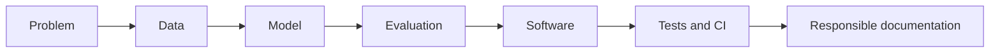

# Hi, I'm Amin Bakhtiari 👋

### AI Engineering Portfolio · Python · Machine Learning · Deep Learning · NLP · MLOps

I build practical AI systems from experiment to tested software. My portfolio combines model development, evaluation, APIs, reproducibility, and responsible documentation—with a special interest in multilingual AI and fashion technology.

- 🔭 Building reliable end-to-end AI projects
- 🌍 Working with English and Persian NLP
- 🧠 Learning through implementation, testing, and iteration
- 🎨 Connecting AI engineering with professional fashion-industry experience
- 💼 Open to junior AI/ML engineering opportunities

## Featured Projects

| Project | What it demonstrates | Verified evidence |
| --- | --- | --- |
| [Zamis Local AI Lab](https://github.com/aminbakhtiari777/mini-gpt) | Local-first assistant, Transformer foundations, memory, voice and web architecture | 23 Python tests + JavaScript voice smoke test |
| [Customer Churn MLOps API](https://github.com/aminbakhtiari777/customer-churn-prediction) | Training pipeline, model artifact, FastAPI-style serving architecture, testing and CI | ROC-AUC 0.8413 · PR-AUC 0.6326 · Recall 0.7834 |
| [Credit Card Fraud Detection](https://github.com/aminbakhtiari777/credit-card-fraud-detection) | Imbalanced classification, threshold analysis, risk-oriented metrics and reproducibility | PR-AUC 0.7156 · ROC-AUC 0.9721 · Recall 0.8673 |
| [Fashion Vision Lab](https://github.com/aminbakhtiari777/fashion-mnist-autoencoder) | CNN classification, autoencoding, GAN/DCGAN experimentation and shared evaluation | CNN accuracy 90.21% · Autoencoder validation MSE 0.0145 |
| [Multilingual Sentiment Transformer Lab](https://github.com/aminbakhtiari777/Movie-Review-Sentiment-Classification-with-Transformer) | English/Persian normalization, Transformer modeling and XLM-R fine-tuning path | IMDB English accuracy 85.99% · 16 tests |
| [Customer Segmentation Platform](https://github.com/aminbakhtiari777/Customer-Segmentation) | Unsupervised learning, stable business segments, artifact persistence and CLI inference | Silhouette 0.5547 · Davies-Bouldin 0.5722 |

## Technical Toolkit

**Languages and data:** Python · NumPy · Pandas · SQL fundamentals  
**Machine learning:** scikit-learn · classification · clustering · evaluation · feature pipelines  
**Deep learning:** TensorFlow/Keras · neural networks · CNN · GAN · Transformer · NLP  
**Engineering:** Git · GitHub Actions · testing · FastAPI · Docker fundamentals · model documentation  
**Current focus:** MLOps · multilingual systems · local AI assistants · production-quality project design

## How I Work

I prefer projects that show the full reasoning path: what problem is being solved, how the data is validated, why a metric matters, what failed, and how the result can be reproduced.

## Current Direction

I am developing toward an AI Engineer role with emphasis on practical machine learning, Transformer-based NLP, local AI, APIs, testing, and deployment workflows. My next portfolio work will extend these systems with stronger datasets, monitoring, and production deployment.

---

Thanks for visiting. Each featured repository contains setup instructions, verified results, limitations, and a clear model or system card.
